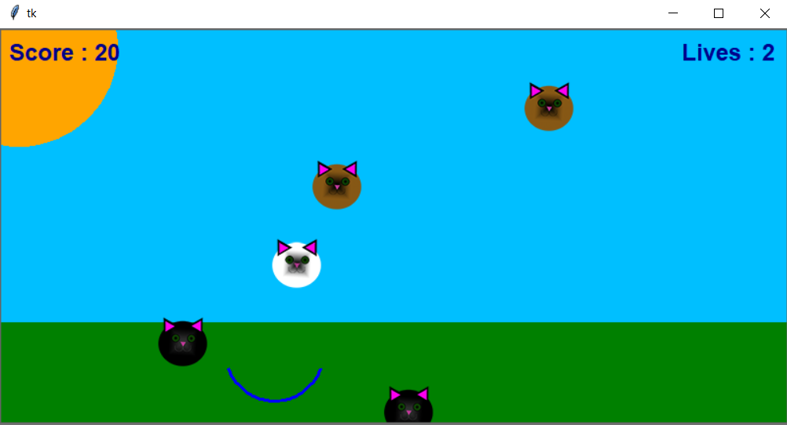

# Cat-catcher-game

The game is about catching as many cats in the basket as possible.

The program was written to learn more about the Tkinter library.

Screenshot from the application:

To run the application, clone the repository to your computer and extract it. Then go to the "dist" folder and run the file "cats_catcher.exe". Let's play! :)
